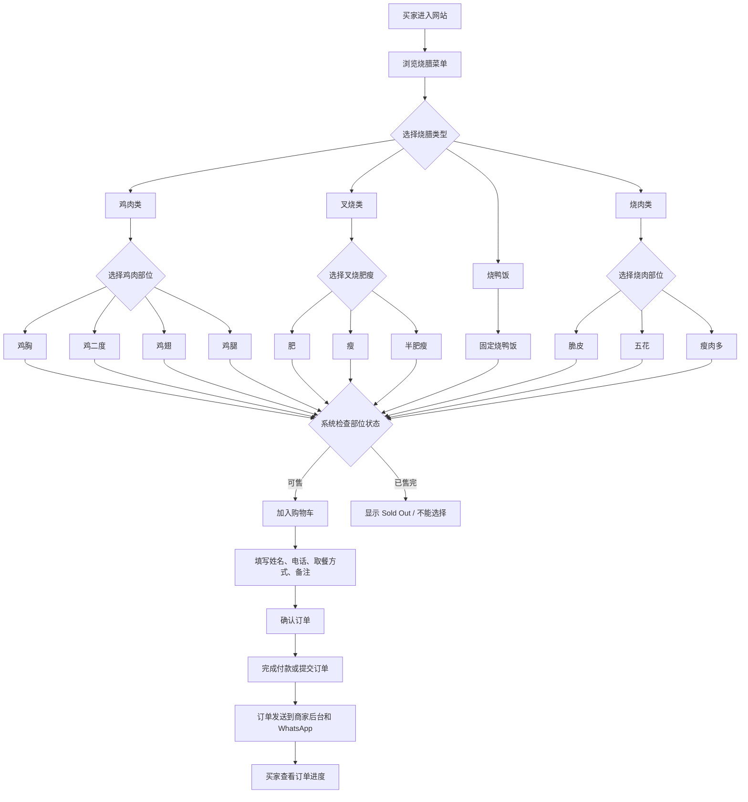
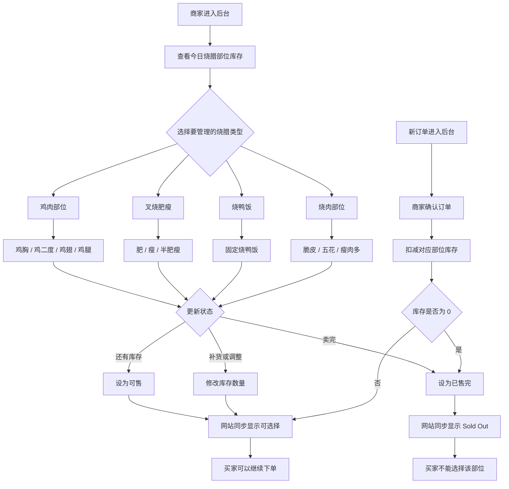

# Roast by Jaden Order Flowcharts

## 1. 买家下单流程（烧腊部位选择）

## 2. 商家管理流程（部位库存与售完控制）

## 后台建议控制项

- 每个部位都可以设置为 `可售` 或 `已售完`
- 可选库存数量，例如鸡腿剩 5 份、叉烧半肥瘦剩 2 份
- 顾客端只显示可售部位，或把售完部位显示成 `Sold Out`
- 订单确认后，系统自动扣减对应部位库存
